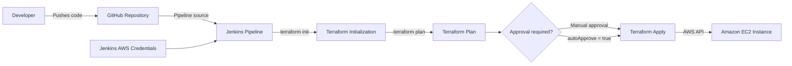

# AWS EC2 Provisioning with Terraform and Jenkins

<div align="center">


**A simple Infrastructure as Code project that provisions an Amazon EC2 instance with Terraform through a Jenkins pipeline.**

</div>

---

## Table of Contents

- [Project Overview](#project-overview)
- [Architecture](#architecture)
- [Provisioned Infrastructure](#provisioned-infrastructure)
- [Jenkins Pipeline](#jenkins-pipeline)
- [Repository Structure](#repository-structure)
- [Prerequisites](#prerequisites)
- [AWS Credentials](#aws-credentials)
- [Jenkins Configuration](#jenkins-configuration)
- [Running the Pipeline](#running-the-pipeline)
- [Running Terraform Manually](#running-terraform-manually)
- [Destroying the Infrastructure](#destroying-the-infrastructure)
- [Important Configuration Notes](#important-configuration-notes)
- [Security Considerations](#security-considerations)
- [Recommended Improvements](#recommended-improvements)

---

## Project Overview

This repository demonstrates how to integrate **Terraform** with **Jenkins** to automate the provisioning of AWS infrastructure.

The Terraform configuration creates a single Amazon EC2 instance, while the Jenkins pipeline performs the complete Infrastructure as Code workflow:

1. Clones the repository.
2. Initializes Terraform.
3. Generates an execution plan.
4. Displays the plan for review.
5. Waits for manual approval when automatic approval is disabled.
6. Applies the approved Terraform plan.

The project is intended as a compact learning example for Terraform, Jenkins, AWS and CI/CD automation.

---

## Architecture



---

## Provisioned Infrastructure

The current `main.tf` configuration provisions:

| Resource | Configuration |
|---|---|
| Cloud provider | Amazon Web Services |
| AWS region | `us-east-1` |
| Resource type | Amazon EC2 instance |
| Instance type | `t2.micro` |
| Instance name | `TF-Instance` |
| AMI | `ami-05fa00d4c63e32376` |

Terraform uses the default AWS networking configuration available in the selected region because the project does not explicitly define a VPC, subnet or security group.

---

## Jenkins Pipeline

The pipeline is defined in the `Jenkinsfile`.

### Pipeline parameter

| Parameter | Default | Description |
|---|---:|---|
| `autoApprove` | `false` | Automatically applies the Terraform plan without waiting for manual approval. |

### Pipeline stages

#### 1. Checkout

The repository is cloned into the `terraform` directory inside the Jenkins workspace.

#### 2. Plan

Jenkins executes:

```bash
terraform init
terraform plan -out=tfplan
terraform show -no-color tfplan > tfplan.txt
```

The generated binary plan is stored as `tfplan`, while its human-readable version is stored as `tfplan.txt`.

#### 3. Approval

When `autoApprove` is set to `false`, Jenkins pauses the pipeline and displays the Terraform plan for review.

An authorized user must approve the deployment before the pipeline continues.

When `autoApprove` is set to `true`, this stage is skipped.

#### 4. Apply

Jenkins applies the previously generated plan:

```bash
terraform apply -input=false tfplan
```

Using the saved plan ensures that Jenkins applies the same changes that were reviewed during the planning stage.

---

## Repository Structure

```text
Terraform-Jenkins/
├── .gitignore
├── Jenkinsfile
├── main.tf
└── README.md
```

| File | Purpose |
|---|---|
| `main.tf` | Defines the AWS provider and EC2 instance. |
| `Jenkinsfile` | Defines the Jenkins CI/CD pipeline. |
| `.gitignore` | Excludes Terraform state, local provider files and variable files. |
| `README.md` | Project documentation. |

---

## Prerequisites

Before running the project, ensure that the following components are available:

- An AWS account.
- A Jenkins server or Jenkins agent capable of running shell commands.
- Terraform installed on the Jenkins agent.
- Git installed on the Jenkins agent.
- Network access from Jenkins to GitHub and AWS APIs.
- AWS permissions sufficient to create, inspect, tag and terminate EC2 instances.
- A default VPC and a compatible subnet in the selected AWS region.

Because the pipeline uses the Jenkins `sh` step, it should run on a Linux or Unix-based Jenkins agent unless the pipeline commands are adapted for Windows.

Commonly required Jenkins plugins include:

- Pipeline
- Git
- Credentials Binding

---

## AWS Credentials

The current `Jenkinsfile` expects two Jenkins credentials with the following exact IDs:

```text
AWS_ACCESS_KEY_ID
AWS_SECRET_ACCESS_KEY
```

Create both credentials in Jenkins as **Secret text** credentials:

1. Open **Manage Jenkins**.
2. Open **Credentials**.
3. Select the appropriate Jenkins credential store and domain.
4. Create a new **Secret text** credential for the AWS access key.
5. Set its ID to `AWS_ACCESS_KEY_ID`.
6. Create another **Secret text** credential for the AWS secret access key.
7. Set its ID to `AWS_SECRET_ACCESS_KEY`.

The pipeline exposes these values to Terraform through the standard AWS environment variables:

```text
AWS_ACCESS_KEY_ID
AWS_SECRET_ACCESS_KEY
```

Do not commit AWS credentials to the repository or place them directly in `main.tf` or the `Jenkinsfile`.

---

## Jenkins Configuration

Create a Jenkins Pipeline job using one of the following approaches.

### Pipeline from SCM

1. In Jenkins, select **New Item**.
2. Enter a job name.
3. Select **Pipeline**.
4. In the Pipeline section, select **Pipeline script from SCM**.
5. Select **Git** as the SCM.
6. Enter the repository URL:

```text
https://github.com/yeshwanthlm/Terraform-Jenkins.git
```

7. Set the branch to:

```text
*/main
```

8. Set the script path to:

```text
Jenkinsfile
```

9. Save the job.

> If this project is stored in a fork or another repository, replace the repository URL in both the Jenkins job and the `checkout` stage of the `Jenkinsfile`.

---

## Running the Pipeline

1. Open the Jenkins job.
2. Select **Build with Parameters**.
3. Choose the value of `autoApprove`.

### Manual approval

Use:

```text
autoApprove = false
```

The pipeline generates the Terraform plan and pauses before applying it.

Review the displayed plan and approve the deployment only when the proposed changes are correct.

### Automatic approval

Use:

```text
autoApprove = true
```

The pipeline skips the approval stage and immediately applies the generated plan.

Automatic approval is convenient for demonstrations, but manual approval is safer for shared or production environments.

---

## Running Terraform Manually

The Terraform configuration can also be executed without Jenkins.

Clone the repository:

```bash
git clone https://github.com/yeshwanthlm/Terraform-Jenkins.git
cd Terraform-Jenkins
```

Initialize Terraform:

```bash
terraform init
```

Validate the configuration:

```bash
terraform validate
```

Preview the infrastructure changes:

```bash
terraform plan
```

Apply the configuration:

```bash
terraform apply
```

Confirm the operation when Terraform requests approval.

---

## Destroying the Infrastructure

The current Jenkins pipeline does not contain a destroy stage.

To remove the EC2 instance manually, run the following command from the directory containing the same Terraform state:

```bash
terraform destroy
```

Review the destroy plan and confirm the operation.

> The project currently stores Terraform state locally. The state file must be preserved to reliably update or destroy resources created by the pipeline.

---

## Important Configuration Notes

### Region and AMI

The AWS provider is configured for:

```hcl
region = "us-east-1"
```

The comment next to the AMI in the original Terraform configuration refers to `us-west-2`.

AMI identifiers are region-specific. Verify that the configured AMI exists in `us-east-1` before running the pipeline. Replace it with a valid AMI for the selected region when necessary.

Example:

```hcl
provider "aws" {
  region = "us-east-1"
}

resource "aws_instance" "foo" {
  ami           = "REPLACE_WITH_VALID_AMI_ID"
  instance_type = "t2.micro"

  tags = {
    Name = "TF-Instance"
  }
}
```

### Local Terraform state

The project currently uses local Terraform state stored in the Jenkins workspace.

This is acceptable for a small demonstration, but it can cause problems when:

- Jenkins cleans the workspace.
- A build runs on another agent.
- Multiple builds execute concurrently.
- More than one person manages the infrastructure.
- The local state file is lost.

Use a remote backend with encryption, versioning and state locking for shared or production environments.

### Existing resources may incur charges

AWS resources can generate costs even when they are created only for testing.

Review the current AWS pricing and destroy resources after completing the exercise.

---

## Security Considerations

- Apply the principle of least privilege to the AWS identity used by Jenkins.
- Do not store credentials in source control.
- Restrict access to the Jenkins credential store.
- Prefer short-lived credentials, an IAM role or workload identity instead of long-lived access keys.
- Keep Terraform and Jenkins plugins updated.
- Review every Terraform plan before applying it.
- Protect Jenkins jobs that can create or destroy cloud resources.
- Use a remote encrypted Terraform backend for shared environments.
- Avoid enabling automatic approval for production deployments.

---

## Recommended Improvements

The repository can be expanded with the following enhancements:

- Move the AWS region, AMI and instance type into Terraform variables.
- Use an AWS data source to select a current AMI dynamically.
- Add `required_version` and `required_providers` constraints.
- Add `terraform fmt -check` and `terraform validate` stages.
- Store Terraform state in a remote backend.
- Add state locking and pipeline concurrency controls.
- Archive the Terraform plan as a Jenkins build artifact.
- Add Terraform outputs for the instance ID, private IP and public IP.
- Add a dedicated destroy pipeline with manual approval.
- Replace static AWS access keys with an IAM role or another short-lived authentication method.
- Define an explicit VPC, subnet, route table and security group.
- Add security scanning with tools such as Checkov, Trivy or Terrascan.
- Add separate development, test and production environments.

---

## Learning Objectives

This project demonstrates:

- Infrastructure provisioning with Terraform.
- Basic Amazon EC2 configuration.
- Jenkins Declarative Pipeline syntax.
- Terraform plan review and manual approval.
- Passing AWS credentials securely from Jenkins.
- Applying a saved Terraform execution plan.
- Integrating Infrastructure as Code into a CI/CD workflow.

---

<div align="center">

**Terraform + Jenkins + AWS**

Infrastructure as Code automated through a CI/CD pipeline.

</div>
